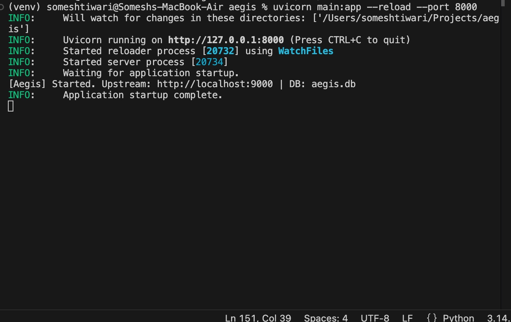
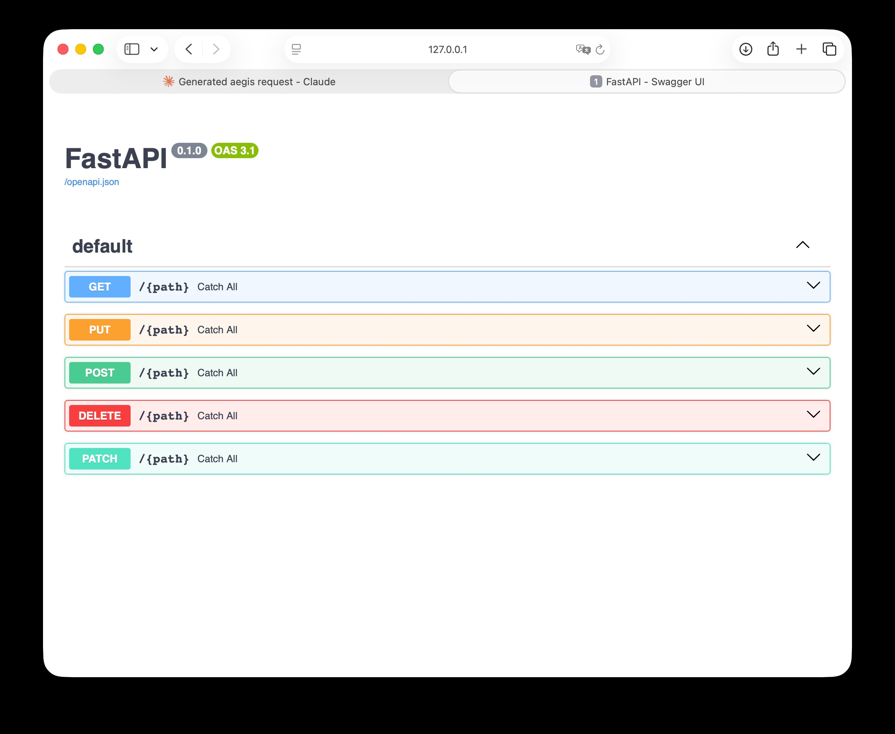
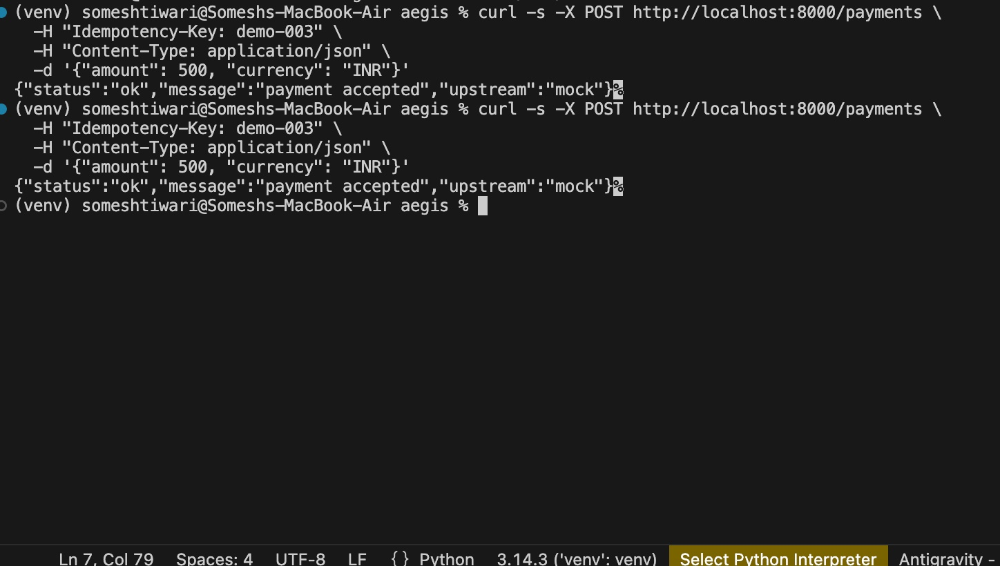
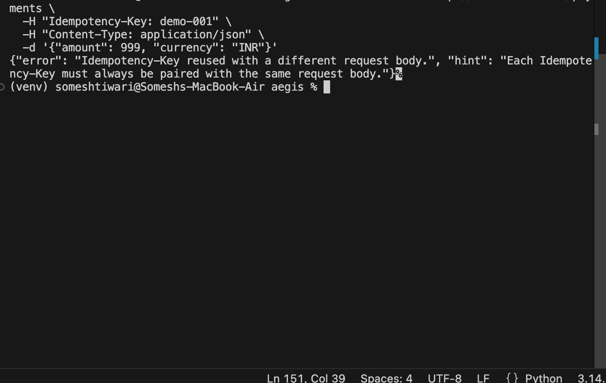
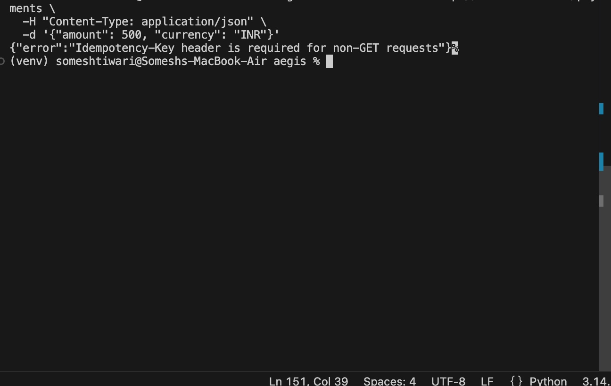
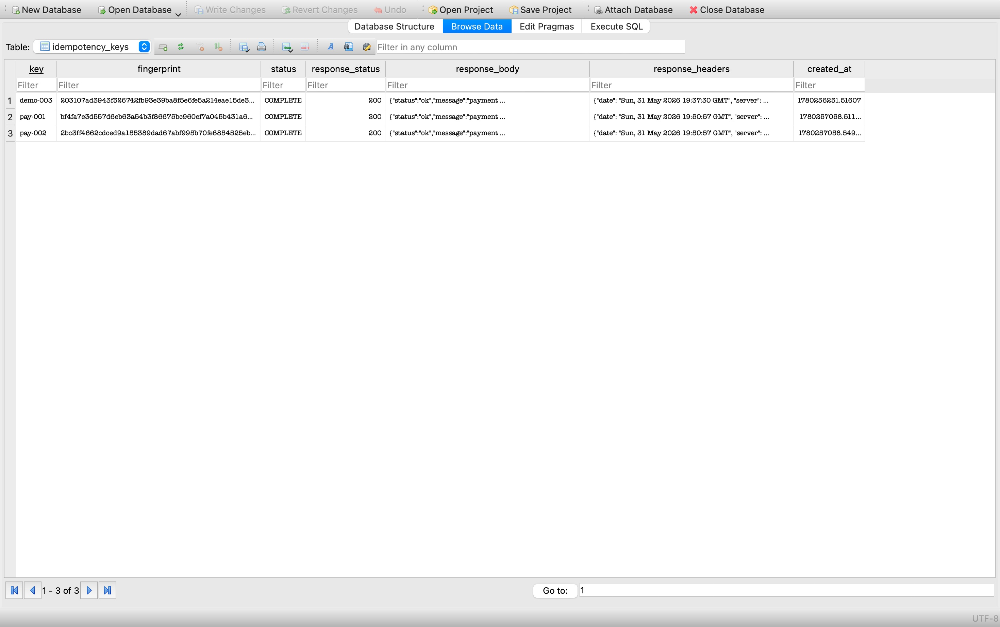
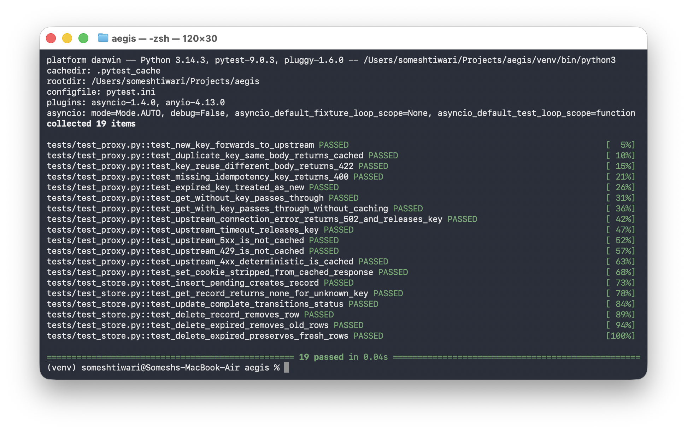

<div align="center">

<picture>
  <source media="(prefers-color-scheme: dark)" srcset="docs/logo-dark.svg">
  
</picture>

<h1>Aegis</h1>

<p><strong>A Stripe-style idempotency layer as a FastAPI reverse proxy.</strong><br/>
Guarantees at-most-once execution for retried HTTP requests — zero upstream changes required.</p>

[](https://www.python.org/)
[](https://fastapi.tiangolo.com/)
[](https://sqlite.org/)
[](LICENSE)
[](https://github.com/someshktiwari/aegis/actions)

</div>

---

## What Is Aegis?

When a client retries a `POST /payment` due to a network timeout, the upstream service has no way to know whether the original request succeeded. Without idempotency, retries cause duplicate charges, duplicate orders, duplicate notifications.

**Aegis sits in front of your service and deduplicates at the network layer.** No code changes to your upstream. Any service — FastAPI, Flask, Express, a legacy monolith — is protected immediately.

```
Client ──► Aegis :8000 ──► Your Service :9000
              │
         SQLite Store
     (idempotency_keys)
```

---

## The Five Scenarios

| Request | Aegis Behaviour | Response |
|---|---|---|
| ✅ **New key** | Forwards to upstream, caches response | Upstream's live response |
| ♻️ **Duplicate key, same body** | Returns cached response — upstream **not called** | Cached response |
| ❌ **Same key, different body** | Rejects — semantic violation | `422 Unprocessable Entity` |
| ⏳ **Same key, concurrent in-flight** | Blocks on lock — returns cached response when A completes | Cached response |
| 💀 **Same key, PENDING from crash** | Finds orphaned PENDING — outcome unknown | `409 Conflict` |

---

## Quick Start

```bash
# 1. Clone and enter
git clone https://github.com/someshktiwari/aegis.git
cd aegis

# 2. Create virtual environment
python3 -m venv venv && source venv/bin/activate

# 3. Install dependencies
python3 -m pip install -r requirements.txt

# 4. Configure
cp .env.example .env

# 5. Start mock upstream (Terminal 1)
uvicorn mock_upstream:app --port 9000

# 6. Start Aegis (Terminal 2)
uvicorn main:app --reload --port 8000
```

Open **http://localhost:8000/docs** for the auto-generated API documentation.

---

## In Action

### Aegis Starting Up



---

### API Documentation — Swagger UI

Aegis auto-generates OpenAPI documentation at `http://localhost:8000/docs`.



---

### New Request + Cached Retry

Both requests return identical JSON. Upstream is only called **once** — the second response is served from cache.



---

### Key Reuse with Different Body → 422

Same idempotency key, different request body. Aegis rejects it immediately.



---

### Missing Header → 400

No `Idempotency-Key` header on a non-GET request.



---

### SQLite Store — idempotency_keys Table

Every processed request is stored with its SHA-256 fingerprint, status (`PENDING` → `COMPLETE`), cached response, and timestamp.



---

### Test Suite — 19 Passed



---

## How It Works

### Concurrency Safety

Every idempotency key has its own `asyncio.Lock`. The lock is held for the **full duration** — from DB read, through the upstream call, to the final DB write. This means:

```
Request A → acquires lock(k1) → writes PENDING → calls upstream (lock held)
Request B → tries lock(k1)   → BLOCKS (waiting)
Request A → upstream returns  → writes COMPLETE → releases lock(k1)
Request B → acquires lock(k1) → reads COMPLETE  → returns cached response
```

A concurrent duplicate (Request B) always gets the correct cached response — it never sees `PENDING` and never gets an error. It simply waits.

**409 is a crash-recovery signal, not a concurrency signal.** It fires only when Aegis crashes after writing `PENDING` but before writing `COMPLETE`. The process dies, the lock disappears, but the orphaned `PENDING` row survives in SQLite. The next request with that key finds `PENDING` and returns 409 — signalling to the client that the original outcome is unknown and a new key must be used.

### Fingerprinting

Request bodies are stored as SHA-256 hashes — a fixed 64-character string regardless of payload size. Constant-time deduplication, no raw body storage.

### TTL Eviction

Records expire after a configurable TTL (default: 24 hours). Eviction runs in two layers:

- **On access** — expired records are deleted before processing (correctness guarantee: never serve a stale cached response)
- **Background sweep** — runs every 5 minutes to bulk-delete expired rows (storage hygiene: no unbounded DB growth)

---

## Architecture

<details>
<summary>Sequence diagram — new key (happy path)</summary>

```
Client          Aegis                   SQLite       Upstream
  │                │                      │              │
  ├── POST ────────►│                      │              │
  │  (+ Idem-Key)  │── get(key) ──────────►│              │
  │                │◄── None ─────────────│              │
  │                │── acquire lock(key)  │              │
  │                │── insert PENDING ────►│              │
  │                │────────────────────────── forward ──►│
  │                │   (lock still held)   │              │
  │                │◄───────────────────────── 201 ───────│
  │                │── update COMPLETE ───►│              │
  │                │── release lock(key)  │              │
  │◄── 201 ────────│                      │              │
```

</details>

<details>
<summary>Sequence diagram — concurrent duplicate (B blocks, gets cached)</summary>

```
Client A        Aegis                   SQLite       Upstream
  │                │                      │              │
  ├── POST ────────►│── acquire lock(k1)   │              │
  │                │── insert PENDING ────►│              │
  │                │────────────────────────── forward ──►│
  │                │   (lock held)         │              │
Client B           │                      │              │
  ├── POST ────────►│                      │              │
  │                │── try lock(k1) → BLOCKS (waiting)    │
  │                │   (A still holds it)  │              │
  │                │◄───────────────────────── 201 ───────│
  │                │── update COMPLETE ───►│              │
  │                │── release lock(k1)   │              │
  │                │── B acquires lock(k1)│              │
  │                │── B reads COMPLETE ──►│              │
  │◄── 201 cached ─│ (B returns cached)    │         (not called)
```

</details>

<details>
<summary>Sequence diagram — 409 crash recovery (PENDING orphan)</summary>

```
Previous run:    Aegis crashed here
                      ↓
  insert PENDING → [CRASH] → lock gone, PENDING row survives in SQLite

Next request with same key:
Client          Aegis                   SQLite
  │                │                      │
  ├── POST ────────►│── acquire lock(key)  │
  │                │── get(key) ──────────►│
  │                │◄── PENDING (orphan) ──│
  │◄── 409 ────────│   outcome unknown     │
```

</details>

---

## Project Structure

```
aegis/
├── main.py                # FastAPI app, lifespan, catch-all route
├── proxy.py               # Core idempotency logic
├── store.py               # SQLite CRUD (aiosqlite)
├── fingerprint.py         # SHA-256 body hashing
├── lock_manager.py        # asyncio.Lock registry
├── eviction.py            # TTL check + background eviction
├── models.py              # Pydantic models
├── config.py              # Environment variable settings
├── mock_upstream.py       # FastAPI mock upstream for local testing
├── docs/
│   ├── logo.svg
│   ├── logo-dark.svg
│   └── screenshots/
├── tests/
│   ├── conftest.py
│   ├── test_proxy.py
│   └── test_store.py
├── DESIGN.md              # Architecture + sequence diagrams
├── DECISIONS.md           # 20 architectural decisions with rationale
└── SETUP.md               # Step-by-step setup guide
```

---

## Configuration

| Variable | Default | Description |
|---|---|---|
| `UPSTREAM_URL` | `http://localhost:9000` | Target service to proxy to |
| `DB_PATH` | `aegis.db` | SQLite database file path |
| `TTL_SECONDS` | `86400` | Key lifetime in seconds (24 hours) |
| `PORT` | `8000` | Aegis listening port |
| `EVICTION_INTERVAL_SECONDS` | `300` | Background sweep interval (5 minutes) |

---

## Tests

```bash
PYTHONPATH=. pytest tests/ -v
```

19 tests covering all scenarios, TTL expiry, missing headers, and GET pass-through.

---

## Tech Stack

| | Technology | Why |
|---|---|---|
| **Framework** | FastAPI | Native async, automatic OpenAPI, dependency injection |
| **Database** | SQLite + aiosqlite | Zero-ops, ACID, sufficient for single-node |
| **Locking** | asyncio.Lock | Per-key in-process lock held across upstream call |
| **Fingerprint** | SHA-256 (hashlib) | Collision-resistant, stdlib, zero dependencies |
| **HTTP client** | httpx AsyncClient | Async-native, mirrors requests API |
| **Config** | pydantic-settings | Type-validated env vars with defaults |

---

## Explicit Non-Goals

Aegis intentionally excludes the following. Each decision is documented in `DECISIONS.md`:

- ❌ Redis / distributed cache
- ❌ Multi-node horizontal scaling
- ❌ Prometheus metrics or tracing
- ❌ Admin UI
- ❌ Library / SDK mode
- ❌ Kubernetes manifests

Aegis solves one problem on a single node, and solves it well.

---

## Documentation

| Document | Contents |
|---|---|
| [`DESIGN.md`](DESIGN.md) | Internal architecture, DB schema, all sequence diagrams, concurrency model |
| [`DECISIONS.md`](DECISIONS.md) | 20 architectural decisions — every choice with full rationale |
| [`SETUP.md`](SETUP.md) | Complete setup, run, and troubleshooting guide |

---

<div align="center">

Built by **[Somesh Kant Tiwari](https://linkedin.com/in/someshkanttiwari)** · [GitHub](https://github.com/someshktiwari)

</div>
