<div align="center">

<picture>
  <source media="(prefers-color-scheme: dark)" srcset="docs/logo-dark.svg">
  
</picture>

<h1>Aegis</h1>

<p><strong>A Stripe-style idempotency layer as a FastAPI reverse proxy.</strong><br/>
Guarantees at-most-once execution for retried HTTP requests — zero upstream changes required.</p>

[](https://www.python.org/)
[](https://fastapi.tiangolo.com/)
[](https://sqlite.org/)
[](tests/)
[](LICENSE)

</div>

---

## What Is Aegis?

When a client retries a `POST /payment` due to a network timeout, the upstream service has no way to know whether the original request succeeded. Without idempotency, retries cause duplicate charges, duplicate orders, duplicate notifications.

**Aegis sits in front of your service and deduplicates at the network layer.** No code changes to your upstream. Any service — FastAPI, Flask, Express, a legacy monolith — is protected immediately.

```
Client ──► Aegis :8000 ──► Your Service :9000
              │
         SQLite Store
     (idempotency_keys)
```

<div align="center">
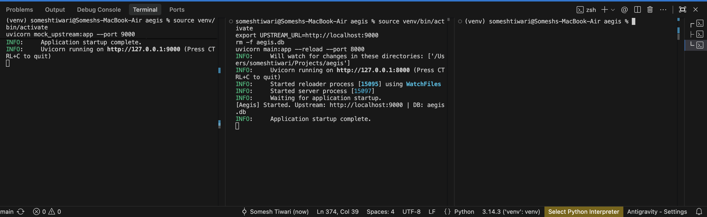
<br/>
<em>Aegis (:8000) starts in front of the upstream service (:9000), with crash recovery on boot.</em>
</div>

---

## The Six Scenarios

| Request | Aegis Behaviour | Response |
|---|---|---|
| ✅ **New key** | Forwards to upstream, caches response | Upstream's live response |
| ♻️ **Duplicate key, same body** | Returns cached response — upstream **not called** | Cached response |
| ❌ **Same key, different body** | Rejects — semantic violation | `422 Unprocessable Entity` |
| ⏳ **Same key, concurrent in-flight** | Blocks on lock — returns cached response when the first completes | Cached response |
| 💀 **Same key, in_flight orphan from crash** | Recovered to `failed` on startup; retry re-runs the request | Fresh upstream response |
| 🔁 **Same key, prior failure (5xx / crash)** | Treated as retryable — re-runs the request | Fresh upstream response |

---

## State Machine

Every idempotency record moves through three states:

```
                    ┌─────────────┐
   new request ───► │  in_flight  │
                    └──────┬──────┘
                           │
        ┌──────────────────┼───────────────────┐
        │ upstream 2xx /   │ upstream 5xx/429 / │ crash (orphan,
        │ deterministic 4xx│ timeout            │ recovered on startup)
        ▼                  ▼                    ▼
  ┌───────────┐      ┌──────────┐         ┌──────────┐
  │ completed │      │  failed  │         │  failed  │
  └───────────┘      └────┬─────┘         └────┬─────┘
   (cached, replayed)     │ client retries     │
                          ▼ same key           ▼
                    ┌─────────────┐
                    │  in_flight  │  (retried fresh)
                    └─────────────┘
```

- **in_flight** — request is being forwarded to upstream, not yet resolved
- **completed** — upstream responded successfully; the response is cached and replayed on retry
- **failed** — upstream returned a transient error, timed out, or the process crashed mid-request; the key is retryable

---

## Quick Start

```bash
# 1. Clone and enter
git clone https://github.com/someshktiwari/aegis.git
cd aegis

# 2. Create virtual environment
python3 -m venv venv && source venv/bin/activate

# 3. Install dependencies
python3 -m pip install -r requirements.txt

# 4. Configure
cp .env.example .env

# 5. Start mock upstream (Terminal 1)
uvicorn mock_upstream:app --port 9000

# 6. Start Aegis (Terminal 2)
export UPSTREAM_URL=http://localhost:9000
uvicorn main:app --reload --port 8000
```

Open **http://localhost:8000/docs** for the auto-generated API documentation.

<div align="center">
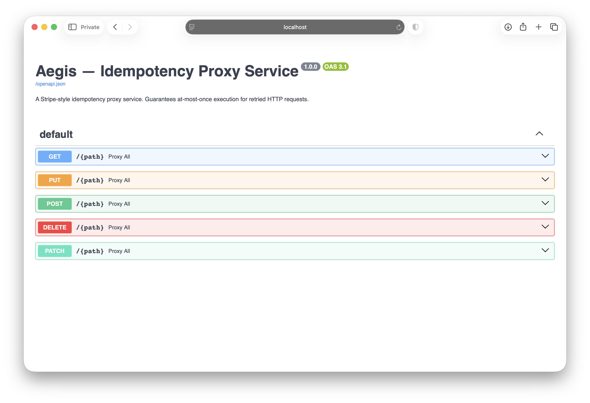
<br/>
<em>Auto-generated OpenAPI docs — Aegis proxies all methods on any path.</em>
</div>

To prove every behaviour by hand, follow [`MANUAL_TESTS.md`](MANUAL_TESTS.md) — step-by-step curl walkthroughs covering new key, cache hit, 422, 400, concurrency, crash recovery, failed-retry, and TTL eviction.

---

## In Action

### New key → forwarded and cached

A first-seen key is forwarded to upstream and the response is stored. The upstream (left) receives the request; the client (right) gets a `200`.

<div align="center">
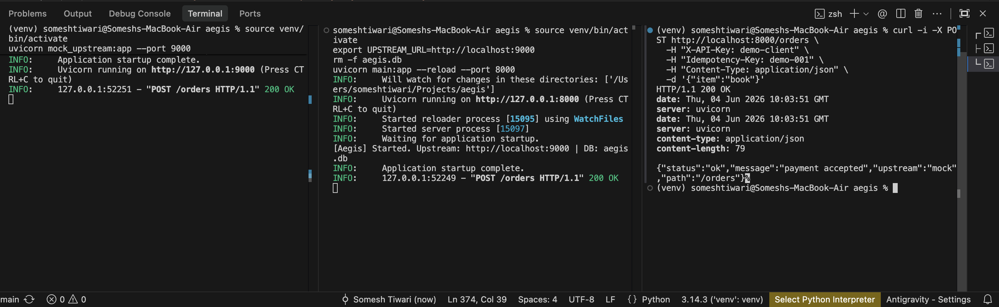
</div>

Every processed request is stored with its SHA-256 fingerprint, status, status code, cached body and headers, plus `created_at` and `expires_at` timestamps.

<div align="center">
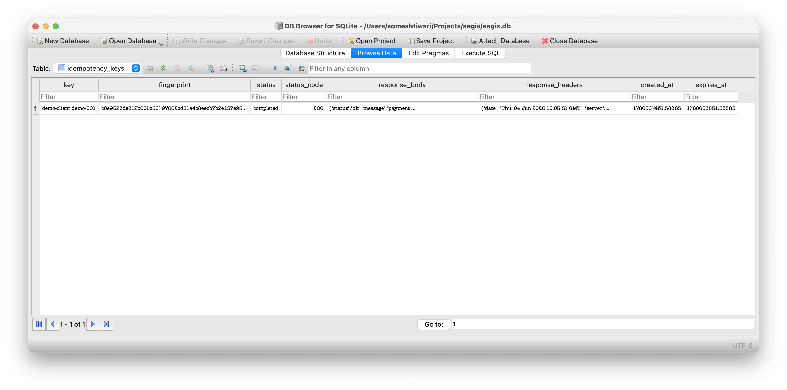
</div>

### Duplicate key, same body → served from cache

Two identical requests. The client (right) sees `200` twice — but the **upstream (left) is hit only once**. The second response is replayed from SQLite.

<div align="center">
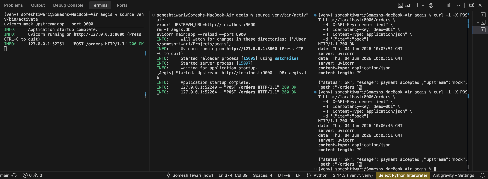
</div>

### Same key, different body → 422

Reusing a key with a changed payload breaks the key-to-body binding. Aegis rejects it without touching upstream.

<div align="center">
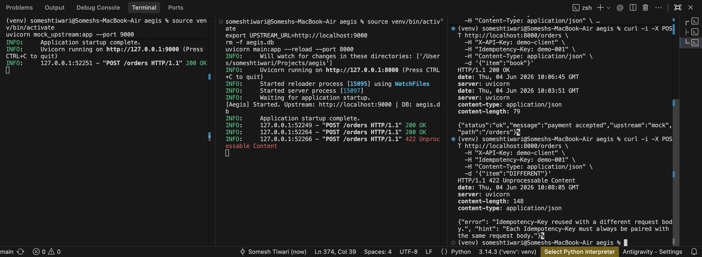
</div>

### Missing Idempotency-Key → 400

Non-GET requests must carry the header.

<div align="center">
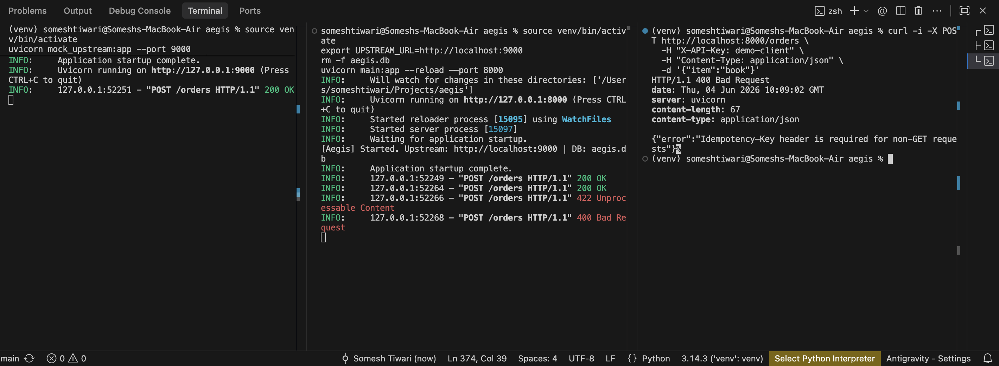
</div>

### GET → always passes through

GET is idempotent by HTTP semantics, so Aegis never caches it — even when an `Idempotency-Key` is supplied, the request is forwarded.

<div align="center">
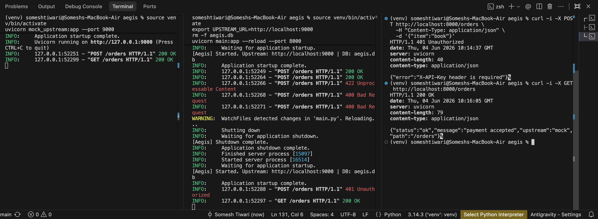
</div>

### Concurrent retries → exactly one execution

Five identical requests fired simultaneously. The per-key lock serialises them: **upstream is hit once**, and the DB holds a single row (`COUNT(*) = 1`). This is the headline guarantee.

<div align="center">
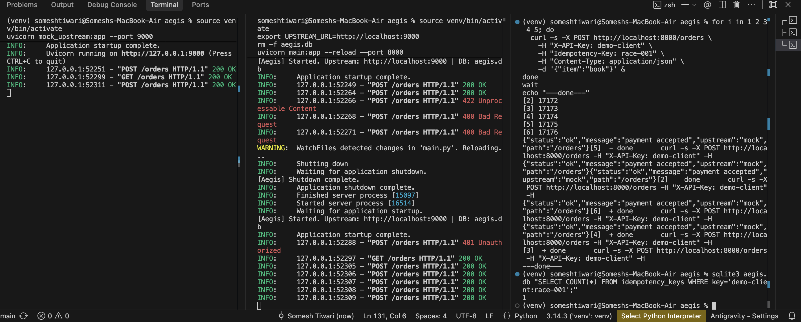
</div>

### Crash recovery → stuck in_flight becomes failed

A record orphaned by a crash (planted here as an old `in_flight` row) is recovered on startup: `recover_stuck_in_flight()` transitions it to `failed`, keeping the key retryable instead of stuck forever.

<div align="center">
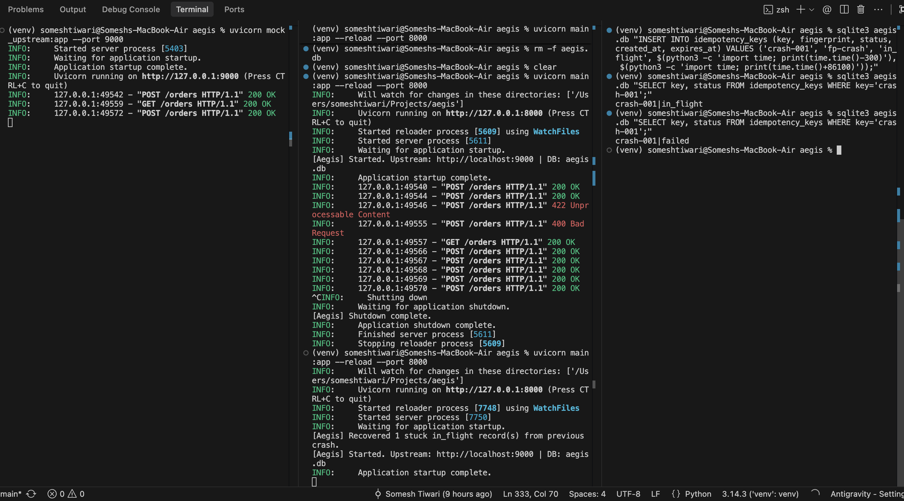
</div>

### Failed record → retryable

A `failed` record (from a 5xx, timeout, or recovered crash) does not lock the client out. The next request with the same key clears it and re-runs fresh — here `crash-001` goes from `failed` to `completed`.

<div align="center">
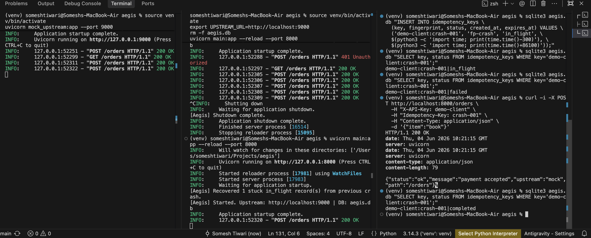
</div>

### Test suite — 19 passing

<div align="center">
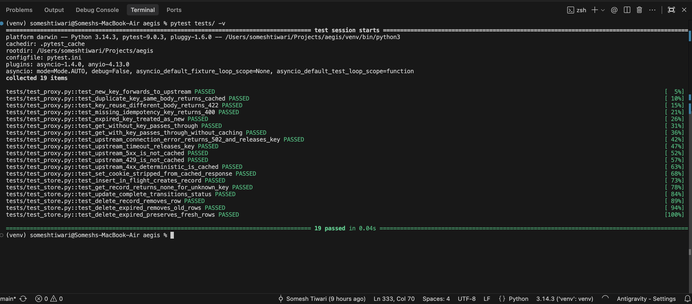
</div>

---

## How It Works

### Concurrency Safety

Every idempotency key has its own `asyncio.Lock`, held for the **full duration** — from DB read, through the upstream call, to the final DB write:

```
Request A → acquires lock(k1) → writes in_flight → calls upstream (lock held)
Request B → tries lock(k1)    → BLOCKS (waiting)
Request A → upstream returns   → writes completed → releases lock(k1)
Request B → acquires lock(k1)  → reads completed  → returns cached response
```

A concurrent duplicate (Request B) always gets the correct cached response — it never sees `in_flight` and never gets an error. It simply waits.

The lock registry itself is guarded by a second registry-level lock, so two concurrent requests for the same brand-new key cannot create two separate lock objects.

### Crash Recovery

If Aegis crashes after writing `in_flight` but before writing the final state, the in-memory lock disappears but the orphaned `in_flight` row survives in SQLite. On the next startup, `recover_stuck_in_flight()` transitions any `in_flight` record older than 60 seconds to `failed`. A subsequent request with that key sees `failed`, treats it as retryable, and re-runs the request fresh.

### Failed Records Are Retryable

A `failed` record (transient 5xx/429 upstream, a timeout, or a recovered crash) does not lock the client out. The next request with the same key clears the failed record and re-runs the request. This is the difference between `failed` and `completed`: completed responses are cached and replayed; failed records are retried.

### Fingerprinting

Requests are fingerprinted with SHA-256 over `method + path + body`, newline-separated so the three parts can never accidentally merge. Headers are excluded — client-injected headers (User-Agent, X-Request-ID) would cause false mismatches. A retry with the same key but a different body produces a different fingerprint and is rejected with 422.

### TTL Eviction

Records expire after a configurable TTL (default: 24 hours), stored per-row as `expires_at`. Eviction runs in two layers:

- **On access** — expired records are deleted before processing (correctness: never serve a stale cached response)
- **Background sweep** — runs every 5 minutes to bulk-delete rows where `expires_at < now` via an indexed comparison (storage hygiene: no unbounded DB growth)

---

## Architecture

<details>
<summary>Sequence diagram — new key (happy path)</summary>

```
Client          Aegis                   SQLite       Upstream
  │                │                      │              │
  ├── POST ────────►│                      │              │
  │  (+ Idem-Key)  │── get(key) ──────────►│              │
  │                │◄── None ─────────────│              │
  │                │── acquire lock(key)  │              │
  │                │── insert in_flight ──►│              │
  │                │────────────────────────── forward ──►│
  │                │   (lock still held)   │              │
  │                │◄───────────────────────── 201 ───────│
  │                │── update completed ──►│              │
  │                │── release lock(key)  │              │
  │◄── 201 ────────│                      │              │
```

</details>

<details>
<summary>Sequence diagram — concurrent duplicate (B blocks, gets cached)</summary>

```
Client A        Aegis                   SQLite       Upstream
  │                │                      │              │
  ├── POST ────────►│── acquire lock(k1)   │              │
  │                │── insert in_flight ──►│              │
  │                │────────────────────────── forward ──►│
  │                │   (lock held)         │              │
Client B           │                      │              │
  ├── POST ────────►│                      │              │
  │                │── try lock(k1) → BLOCKS (waiting)    │
  │                │◄───────────────────────── 201 ───────│
  │                │── update completed ──►│              │
  │                │── release lock(k1)   │              │
  │                │── B acquires lock(k1)│              │
  │                │── B reads completed ─►│              │
  │◄── 201 cached ─│ (B returns cached)    │         (not called)
```

</details>

<details>
<summary>Sequence diagram — crash recovery (in_flight orphan)</summary>

```
Previous run:    Aegis crashed here
                      ↓
  insert in_flight → [CRASH] → lock gone, in_flight row survives in SQLite

On next startup:
  recover_stuck_in_flight() → in_flight (older than 60s) → failed

Next request with same key:
Client          Aegis                   SQLite
  │                │                      │
  ├── POST ────────►│── acquire lock(key)  │
  │                │── get(key) ──────────►│
  │                │◄── failed ────────────│
  │                │── clear, treat as new │
  │                │── retry fresh ───────►│
  │◄── 200 ────────│                       │
```

</details>

---

## Project Structure

```
aegis/
├── main.py                # FastAPI app, lifespan, catch-all route
├── proxy.py               # Core idempotency logic
├── store.py               # SQLite CRUD (aiosqlite)
├── fingerprint.py         # SHA-256 of method + path + body
├── lock_manager.py        # Per-key asyncio.Lock registry
├── eviction.py            # TTL check + background eviction
├── models.py              # SQLModel IdempotencyRecord + State enum
├── config.py              # Environment variable settings
├── mock_upstream.py       # FastAPI mock upstream for local testing
├── docs/
│   ├── logo.svg
│   ├── logo-dark.svg
│   └── screenshots/
├── tests/
│   ├── conftest.py
│   ├── test_proxy.py
│   └── test_store.py
├── docs/DESIGN.md         # Architecture, DB schema, sequence diagrams
├── docs/DECISIONS.md      # Architectural decisions with rationale
├── MANUAL_TESTS.md        # Step-by-step proof of every behaviour
└── SETUP.md               # Setup and run guide
```

---

## Configuration

| Variable | Default | Description |
|---|---|---|
| `UPSTREAM_URL` | `http://localhost:9000` | Target service to proxy to |
| `DB_PATH` | `aegis.db` | SQLite database file path |
| `TTL_SECONDS` | `86400` | Key lifetime in seconds (24 hours) |
| `PORT` | `8000` | Aegis listening port |
| `EVICTION_INTERVAL_SECONDS` | `300` | Background sweep interval (5 minutes) |

---

## Tests

```bash
PYTHONPATH=. pytest tests/ -v
```

19 tests covering all scenarios: new key, cache hit, 422 mismatch, 400 missing key, GET pass-through, concurrent retries, connection/timeout handling, 5xx and 429 not cached, deterministic 4xx cached, expired-key retry, and Set-Cookie stripping.

---

## Tech Stack

| | Technology | Why |
|---|---|---|
| **Framework** | FastAPI | Native async, automatic OpenAPI, dependency injection |
| **Database** | SQLite + aiosqlite | Zero-ops, ACID, sufficient for single-node |
| **Models** | SQLModel | Type-safe schema; the record class maps directly to the table |
| **Locking** | asyncio.Lock | Per-key in-process lock held across the upstream call |
| **Fingerprint** | SHA-256 (hashlib) | Collision-resistant, stdlib, zero dependencies |
| **HTTP client** | httpx AsyncClient | Async-native, mirrors requests API |
| **Config** | pydantic-settings | Type-validated env vars with defaults |

---

## Explicit Non-Goals

Aegis intentionally excludes the following. Each decision is documented in `docs/DECISIONS.md`:

- ❌ Redis / distributed cache
- ❌ Multi-node horizontal scaling
- ❌ Prometheus metrics or tracing
- ❌ Admin UI
- ❌ Library / SDK mode
- ❌ Kubernetes manifests

Aegis solves one problem on a single node, and solves it well.

---

## Documentation

| Document | Contents |
|---|---|
| [`docs/DESIGN.md`](docs/DESIGN.md) | Internal architecture, DB schema, sequence diagrams, concurrency model |
| [`docs/DECISIONS.md`](docs/DECISIONS.md) | Architectural decisions — every choice with full rationale |
| [`MANUAL_TESTS.md`](MANUAL_TESTS.md) | Step-by-step curl proof of every behaviour |
| [`SETUP.md`](SETUP.md) | Complete setup, run, and troubleshooting guide |

---

<div align="center">

Built by **[Somesh Kant Tiwari](https://www.linkedin.com/in/someshkanttiwari/)** · [GitHub](https://github.com/someshktiwari)

</div>